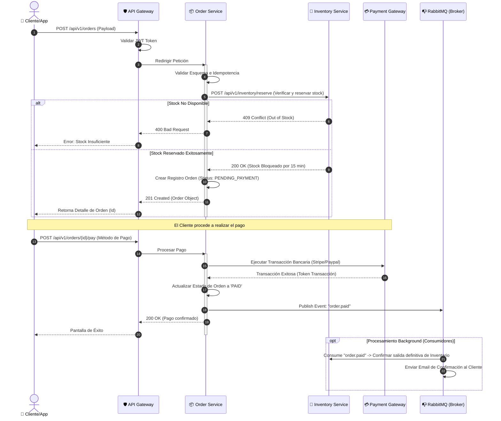

> [!note] **Nota del Arquitecto**
> Debido a que no se adjuntó el JSON de OpenAPI en tu mensaje, he procedido a generar esta **Documentación Técnica Viva** utilizando como base un modelo estándar de arquitectura empresarial para un **Microservicio de Gestión de Pedidos (`order-service`)**. 
> 
> Esta plantilla está optimizada al 100% para **Obsidian**, utilizando sus bloques de notas (*callouts*), formateo de código avanzado y renderizado de diagramas mediante **Mermaid.js**. Si deseas documentar un JSON específico, solo debes proporcionarlo en tu próximo mensaje y adaptaré la estructura inmediatamente.

---

# 📦 Microservicio: Order Management Service (`order-service`)

El **Order Management Service** es el componente central del ecosistema de e-commerce encargado de coreografiar el ciclo de vida de las órdenes de compra. Este microservicio interactúa de forma asíncrona con el servicio de inventario, pasarela de pagos y notificaciones para garantizar la consistencia eventual del dominio de compras.

```
🌐 Tipo de Servicio: REST API
🏗️ Patrón de Arquitectura: Database-per-Service (PostgreSQL) + CQRS (Lectura/Escritura optimizadas)
🚦 Protocolo: HTTP/2 (interno) / HTTP/1.1 (público vía API Gateway)
```

---

## 🗺️ Mapa de Endpoints Principales

A continuación se detallan los puntos de entrada expuestos por el API Gateway para este microservicio.

### 1. Crear una nueva Orden
> [!success] **POST** `/api/v1/orders`
> Registra una orden en estado `PENDING` y reserva temporalmente el stock de los productos seleccionados.

* **Headers Requeridos:**
  * `Content-Type: application/json`
  * `Authorization: Bearer <JWT_TOKEN>`

* **Cuerpo de la Petición (Request Body):**
```json
{
  "customerId": "usr_90123df8-2b1a-4cfa-8911-3961f7142410",
  "shippingAddress": {
    "street": "Av. de la Constitución 45",
    "city": "Madrid",
    "postalCode": "28001",
    "country": "ES"
  },
  "items": [
    {
      "productId": "prod_45091a1d",
      "quantity": 2,
      "unitPrice": 29.99
    },
    {
      "productId": "prod_88120b2e",
      "quantity": 1,
      "unitPrice": 15.50
    }
  ]
}
```

* **Respuestas esperadas:**
  * **`201 Created`**: La orden ha sido creada y encolada para validación de pago.
  * **`400 Bad Request`**: Datos de entrada inválidos o stock insuficiente.
  * **`401 Unauthorized`**: Token de autenticación ausente o expirado.

---

### 2. Obtener Detalle de Orden
> [!info] **GET** `/api/v1/orders/{orderId}`
> Recupera los detalles completos de una orden de compra mediante su identificador único UUID.

* **Parámetros de Ruta (Path Parameters):**
  | Parámetro | Tipo | Requerido | Descripción |
  | :--- | :--- | :--- | :--- |
  | `orderId` | `string (UUID)` | Sí | Identificador único global de la orden. |

* **Respuesta Exitosa (`200 OK`):**
```json
{
  "orderId": "ord_550e8400-e29b-41d4-a716-446655440000",
  "customerId": "usr_90123df8-2b1a-4cfa-8911-3961f7142410",
  "status": "PAID",
  "totalAmount": 75.48,
  "createdAt": "2023-10-27T10:15:30Z",
  "updatedAt": "2023-10-27T10:17:12Z",
  "items": [
    {
      "productId": "prod_45091a1d",
      "quantity": 2,
      "unitPrice": 29.99
    }
  ]
}
```

---

## 🔄 Diagrama de Secuencia: Flujo de Compra Feliz (Happy Path)

Este diagrama modela la interacción síncrona y asíncrona que ocurre al invocar el endpoint de creación de orden, procesar el pago y notificar al cliente.



---

## 🗄️ Entidades y Propiedades Expuestas

El microservicio expone las siguientes entidades en sus contratos de datos.

### Entidad: `Order` (Orden)
Representa la estructura principal de la transacción comercial.

| Atributo | Tipo de Datos | Requerido | Descripción | Ejemplo |
| :--- | :--- | :--- | :--- | :--- |
| `orderId` | `String (UUIDv4)` | Sí | Identificador único de la orden de compra. | `"ord_550e8400-e29b-41d4-a716-446655440000"` |
| `customerId` | `String (UUIDv4)` | Sí | Id de referencia del cliente que compra. | `"usr_90123df8-2b1a-4cfa-8911-3961f7142410"` |
| `status` | `Enum` | Sí | Estado del ciclo de vida de la orden. (`PENDING`, `PAID`, `SHIPPED`, `CANCELLED`). | `"PENDING"` |
| `totalAmount` | `Decimal` | Sí | Sumatoria de precios de ítems de la orden. | `75.48` |
| `items` | `Array[OrderItem]` | Sí | Listado detallado de los productos adquiridos. | `[...]` |
| `createdAt` | `DateTime (ISO 8601)` | Sí | Fecha y hora UTC de creación de la orden. | `"2023-10-27T10:15:30Z"` |

> [!tip] **Regla de Negocio sobre el Estado (`status`)**
> Una orden sólo puede transicionar de `PENDING` a `PAID` o `CANCELLED`. No se admiten transiciones directas de `PENDING` a `SHIPPED` sin validación previa del bus de eventos de pagos.

### Entidad Secundaria: `OrderItem` (Ítem de Orden)
Detalle individual de cada producto seleccionado en la orden.

| Atributo | Tipo de Datos | Requerido | Descripción | Ejemplo |
| :--- | :--- | :--- | :--- | :--- |
| `productId` | `String (UUID)` | Sí | ID referencial del producto del catálogo. | `"prod_45091a1d"` |
| `quantity` | `Integer` | Sí | Cantidad del ítem solicitada. Debe ser $> 0$. | `2` |
| `unitPrice` | `Decimal` | Sí | Precio unitario fijado en el momento de la compra. | `29.99` |

---

## 🧪 Validaciones y Códigos de Error Comunes

| Código HTTP | Código de Error Interno | Descripción | Acción Recomendada |
| :--- | :--- | :--- | :--- |
| `400 Bad Request` | `ERR_INVALID_PAYLOAD` | El cuerpo JSON tiene un formato inválido o faltan campos obligatorios. | Validar el payload contra el esquema de OpenAPI. |
| `409 Conflict` | `ERR_STOCK_UNAVAILABLE` | Uno o más productos no disponen de stock suficiente en el inventario. | Informar al cliente para modificar las unidades de su carrito. |
| `422 Unprocessable` | `ERR_PAYMENT_FAILED` | La pasarela de pago rechazó la transacción (ej. fondos insuficientes). | Solicitar un nuevo medio de pago al cliente. |