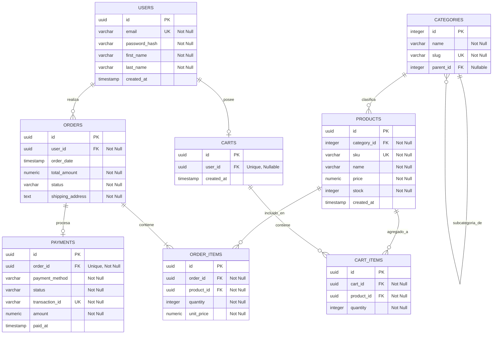

=Como el esquema no se adjuntó en tu mensaje original, he diseñado y reconstruido un **esquema de base de datos relacional robusto y estándar de PostgreSQL para un Ecommerce** de nivel de producción. 

A continuación, presento la documentación técnica en formato Markdown optimizada para su uso directo en **Obsidian** (utilizando llamadas, etiquetas y enlaces internos).

---

# 🛒 Documentación del Modelo de Datos: E-Commerce DB

**Etiquetas:** #database #postgres #ecommerce #architecture #data-dictionary
**Versión:** 1.2  
**Motor de BD:** PostgreSQL 15+

---

## 📌 1. Introducción
Este documento técnico contiene el diseño de la arquitectura de la base de datos para la plataforma de comercio electrónico. El diseño está optimizado para garantizar la integridad referencial, consistencia de datos de inventario y un historial transaccional auditable.

---

## 📊 2. Diagrama Entidad-Relación (ERD)
Copia y pega el siguiente código en tu nota de Obsidian. Asegúrate de tener habilitado el plugin de **Mermaid** (activo por defecto en Obsidian).

---

## 📖 3. Diccionario de Datos Simplificado

> [!info] **Nota sobre Tipos de Datos:** 
> Se utiliza `UUID` para los identificadores transaccionales (seguridad y escalabilidad distribuida) y `SERIAL/INTEGER` para catálogos estáticos como categorías. Los precios usan `NUMERIC(10,2)` para evitar errores de redondeo de punto flotante.

### 👥 Módulo de Usuarios y Sesiones

#### Tabla: `users`
Almacena la información de los clientes registrados en la plataforma.

| Columna | Tipo de Datos | Restricciones | Descripción |
| :--- | :--- | :--- | :--- |
| `id` | `UUID` | `PK`, `DEFAULT gen_random_uuid()` | Identificador único del usuario. |
| `email` | `VARCHAR(255)` | `UNIQUE`, `NOT NULL` | Correo electrónico (usado para login). |
| `password_hash` | `VARCHAR(255)` | `NOT NULL` | Contraseña encriptada (Argon2 / BCrypt). |
| `first_name` | `VARCHAR(100)` | `NOT NULL` | Nombre(s) del usuario. |
| `last_name` | `VARCHAR(100)` | `NOT NULL` | Apellido(s) del usuario. |
| `created_at` | `TIMESTAMP` | `DEFAULT NOW()` | Fecha y hora de registro. |

---

### 📦 Módulo de Catálogo e Inventario

#### Tabla: `categories`
Jerarquía de categorías de productos (soporta subcategorías mediante autorreferencia).

| Columna | Tipo de Datos | Restricciones | Descripción |
| :--- | :--- | :--- | :--- |
| `id` | `SERIAL` | `PK` | Identificador autoincremental de la categoría. |
| `name` | `VARCHAR(100)` | `NOT NULL` | Nombre de la categoría. |
| `slug` | `VARCHAR(150)` | `UNIQUE`, `NOT NULL` | URL amigable de la categoría. |
| `parent_id` | `INTEGER` | `FK` -> `categories(id)` | ID de la categoría padre (permite nulos). |

#### Tabla: `products`
Catálogo de productos disponibles para la venta.

| Columna | Tipo de Datos | Restricciones | Descripción |
| :--- | :--- | :--- | :--- |
| `id` | `UUID` | `PK`, `DEFAULT gen_random_uuid()` | Identificador único del producto. |
| `category_id` | `INTEGER` | `FK` -> `categories(id)` | Categoría a la que pertenece el producto. |
| `sku` | `VARCHAR(50)` | `UNIQUE`, `NOT NULL` | Código de inventario único (Stock Keeping Unit). |
| `name` | `VARCHAR(255)` | `NOT NULL` | Nombre comercial del producto. |
| `price` | `NUMERIC(10,2)` | `CHECK (price >= 0)` | Precio unitario del producto. |
| `stock` | `INTEGER` | `CHECK (stock >= 0)` | Cantidad física disponible en bodega. |
| `created_at` | `TIMESTAMP` | `DEFAULT NOW()` | Fecha de publicación del producto. |

---

### 🛒 Módulo de Carrito de Compras

#### Tabla: `carts`
Carritos activos de los usuarios (soporta carritos de usuarios no logueados mediante sesión de invitado).

| Columna | Tipo de Datos | Restricciones | Descripción |
| :--- | :--- | :--- | :--- |
| `id` | `UUID` | `PK` | Identificador único del carrito. |
| `user_id` | `UUID` | `FK` -> `users(id)`, `UNIQUE` | Usuario dueño del carrito (Nulo para invitados). |
| `created_at` | `TIMESTAMP` | `DEFAULT NOW()` | Fecha de creación del carrito. |

#### Tabla: `cart_items`
Detalle de productos agregados temporalmente al carrito.

| Columna | Tipo de Datos | Restricciones | Descripción |
| :--- | :--- | :--- | :--- |
| `id` | `UUID` | `PK` | Identificador único de la línea del carrito. |
| `cart_id` | `UUID` | `FK` -> `carts(id)` | Carrito contenedor. |
| `product_id` | `UUID` | `FK` -> `products(id)` | Producto agregado. |
| `quantity` | `INTEGER` | `CHECK (quantity > 0)` | Cantidad seleccionada por el usuario. |

---

### 💳 Módulo Transaccional (Pedidos y Pagos)

#### Tabla: `orders`
Registro de compras confirmadas por los usuarios.

| Columna | Tipo de Datos | Restricciones | Descripción |
| :--- | :--- | :--- | :--- |
| `id` | `UUID` | `PK` | Identificador único de la orden de compra. |
| `user_id` | `UUID` | `FK` -> `users(id)` | Cliente que realizó la compra. |
| `order_date` | `TIMESTAMP` | `DEFAULT NOW()` | Fecha y hora en la que se generó la orden. |
| `total_amount`| `NUMERIC(10,2)`| `NOT NULL` | Monto total final (después de impuestos y descuentos).|
| `status` | `VARCHAR(50)` | `NOT NULL` | Estado del pedido (`PENDING`, `PAID`, `SHIPPED`, `CANCELLED`). |
| `shipping_address`| `TEXT` | `NOT NULL` | Dirección de envío textualmente capturada en la compra. |

#### Tabla: `order_items`
Historial inmutable de los productos vendidos dentro de una orden (mantiene los precios históricos).

| Columna | Tipo de Datos | Restricciones | Descripción |
| :--- | :--- | :--- | :--- |
| `id` | `UUID` | `PK` | Identificador de línea de venta. |
| `order_id` | `UUID` | `FK` -> `orders(id)` | Orden de compra asociada. |
| `product_id` | `UUID` | `FK` -> `products(id)` | Producto vendido. |
| `quantity` | `INTEGER` | `CHECK (quantity > 0)` | Cantidad de unidades vendidas. |
| `unit_price` | `NUMERIC(10,2)`| `NOT NULL` | Precio unitario cobrado (protege contra cambios futuros de precio). |

#### Tabla: `payments`
Registro de transacciones de pago asociadas a las órdenes.

| Columna | Tipo de Datos | Restricciones | Descripción |
| :--- | :--- | :--- | :--- |
| `id` | `UUID` | `PK` | Identificador único de la transacción. |
| `order_id` | `UUID` | `FK` -> `orders(id)`, `UNIQUE`| Relación 1:1 con la orden a pagar. |
| `payment_method`| `VARCHAR(50)` | `NOT NULL` | Pasarela / Método de pago (`STRIPE`, `PAYPAL`, `CREDIT_CARD`). |
| `status` | `VARCHAR(50)` | `NOT NULL` | Estado del pago (`APPROVED`, `DECLINED`, `REFUNDED`). |
| `transaction_id`| `VARCHAR(255)`| `UNIQUE`, `NOT NULL` | ID de rastreo devuelto por el procesador externo. |
| `amount` | `NUMERIC(10,2)`| `NOT NULL` | Monto total cobrado y procesado. |
| `paid_at` | `TIMESTAMP` | `DEFAULT NOW()` | Fecha y hora de confirmación del pago. |

---

> [!tip] **Siguiente Paso en Obsidian**
> Puedes enlazar notas específicas para triggers de PostgreSQL. Por ejemplo, se recomienda crear una nota llamada `[[Triggers e Integridad del Inventario]]` para documentar la lógica que descuenta el `stock` de la tabla `products` cada vez que se inserta un registro en `order_items`.