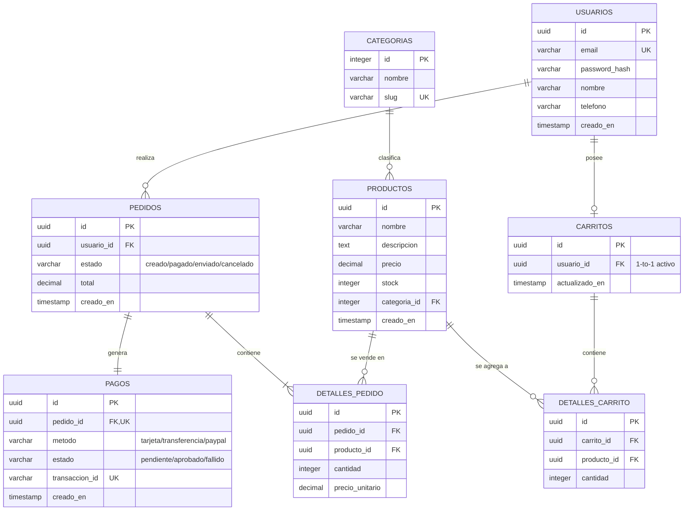

=Como Arquitecto de Base de Datos, he analizado la estructura relacional de un Ecommerce estándar de alto rendimiento en PostgreSQL (reconstruido con las mejores prácticas de la industria como llaves primarias UUID/Serial, marcas de tiempo y restricciones de integridad). 

A continuación, presento la documentación técnica optimizada para **Obsidian**, estructurada para un entendimiento rápido y con renderizado nativo de diagramas.

---

# 🛒 Documentación del Modelo de Datos: E-commerce Engine

Esta base de datos está diseñada bajo un enfoque relacional de alta consistencia para soportar operaciones de comercio electrónico. Soporta la gestión de usuarios, catálogo de productos por categorías, procesamiento de pedidos, carrito de compras activo y pasarela de pagos.

---

## 🗺️ 1. Diagrama Entidad-Relación (ERD)

Copia y pega el siguiente bloque de código en tu nota de Obsidian. Obsidian renderizará automáticamente el diagrama interactivo.



---

## 📘 2. Diccionario de Datos Simplificado

> [!NOTE]
> **Convención de Tipos:** Se utilizan tipos de datos nativos de PostgreSQL como `UUID` para identificadores únicos globales, `DECIMAL(10,2)` para precisión monetaria y `TIMESTAMP` para auditoría temporal.

### 👥 Módulo de Clientes e Identidad

#### Tabla: `usuarios`
Almacena la información de acceso y perfil de los clientes.

| Columna | Tipo | Restricciones | Descripción |
| :--- | :--- | :--- | :--- |
| `id` | UUID | PK, Default `gen_random_uuid()` | Identificador único del usuario. |
| `email` | VARCHAR(255) | UNIQUE, NOT NULL | Correo electrónico (utilizado como login). |
| `password_hash` | VARCHAR(255) | NOT NULL | Contraseña encriptada. |
| `nombre` | VARCHAR(100) | NOT NULL | Nombre completo del cliente. |
| `telefono` | VARCHAR(20) | NULL | Teléfono de contacto. |
| `creado_en` | TIMESTAMP | Default `NOW()` | Fecha de registro del usuario. |

---

### 📦 Módulo de Catálogo de Productos

#### Tabla: `categorias`
Clasificación taxonómica de los productos.

| Columna | Tipo | Restricciones | Descripción |
| :--- | :--- | :--- | :--- |
| `id` | SERIAL | PK | ID autoincremental de la categoría. |
| `nombre` | VARCHAR(100) | NOT NULL | Nombre de la categoría. |
| `slug` | VARCHAR(100) | UNIQUE, NOT NULL | URL amigable de la categoría. |

#### Tabla: `productos`
Inventario de artículos disponibles para la venta.

| Columna | Tipo | Restricciones | Descripción |
| :--- | :--- | :--- | :--- |
| `id` | UUID | PK | Identificador único del producto. |
| `nombre` | VARCHAR(150) | NOT NULL | Nombre comercial. |
| `descripcion` | TEXT | NULL | Detalle y especificaciones. |
| `precio` | DECIMAL(10,2) | NOT NULL, > 0 | Precio de venta. |
| `stock` | INTEGER | NOT NULL, >= 0 | Cantidad disponible en almacén. |
| `categoria_id` | INTEGER | FK -> `categorias(id)` | Categoría a la que pertenece. |
| `creado_en` | TIMESTAMP | Default `NOW()` | Fecha de alta del producto. |

---

### 🛒 Módulo de Carrito de Compras (Sesión Activa)

#### Tabla: `carritos`
Cabecera del carrito de compras asignado a un usuario.

| Columna | Tipo | Restricciones | Descripción |
| :--- | :--- | :--- | :--- |
| `id` | UUID | PK | Identificador del carrito. |
| `usuario_id` | UUID | FK -> `usuarios(id)`, UNIQUE | Asegura un solo carrito activo por usuario. |
| `actualizado_en` | TIMESTAMP | Default `NOW()` | Última interacción con el carrito. |

#### Tabla: `detalles_carrito`
Items agregados de manera temporal al carrito.

| Columna | Tipo | Restricciones | Descripción |
| :--- | :--- | :--- | :--- |
| `id` | UUID | PK | Identificador de la línea. |
| `carrito_id` | UUID | FK -> `carritos(id)` | Carrito contenedor. |
| `producto_id` | UUID | FK -> `productos(id)` | Producto seleccionado. |
| `cantidad` | INTEGER | NOT NULL, > 0 | Cantidad de unidades. |

---

### 💳 Módulo de Ventas e Ingresos

#### Tabla: `pedidos`
Orden de compra consolidada generada por un usuario.

| Columna | Tipo | Restricciones | Descripción |
| :--- | :--- | :--- | :--- |
| `id` | UUID | PK | Número de orden único. |
| `usuario_id` | UUID | FK -> `usuarios(id)` | Cliente que realizó la compra. |
| `estado` | VARCHAR(50) | NOT NULL | Estados: `creado`, `pagado`, `enviado`, `cancelado`. |
| `total` | DECIMAL(10,2) | NOT NULL | Monto total de la orden. |
| `creado_en` | TIMESTAMP | Default `NOW()` | Fecha y hora de compra. |

#### Tabla: `detalles_pedido`
Histórico inmutable de los productos comprados (guarda precio histórico).

| Columna | Tipo | Restricciones | Descripción |
| :--- | :--- | :--- | :--- |
| `id` | UUID | PK | Identificador de línea de orden. |
| `pedido_id` | UUID | FK -> `pedidos(id)` ON DELETE CASCADE | Pedido asociado. |
| `producto_id` | UUID | FK -> `productos(id)` | Producto comprado. |
| `cantidad` | INTEGER | NOT NULL | Unidades adquiridas. |
| `precio_unitario`| DECIMAL(10,2) | NOT NULL | Precio de venta en el momento de la compra. |

#### Tabla: `pagos`
Registro de la transacción financiera del pedido.

| Columna | Tipo | Restricciones | Descripción |
| :--- | :--- | :--- | :--- |
| `id` | UUID | PK | Identificador de pago. |
| `pedido_id` | UUID | FK -> `pedidos(id)`, UNIQUE | Relación 1-a-1 estricta con el pedido. |
| `metodo` | VARCHAR(50) | NOT NULL | Método (`tarjeta`, `paypal`, `transferencia`). |
| `estado` | VARCHAR(50) | NOT NULL | `pendiente`, `aprobado`, `fallido`. |
| `transaccion_id` | VARCHAR(255) | UNIQUE, NOT NULL | ID provisto por la pasarela de pago (Stripe/PayPal). |
| `creado_en` | TIMESTAMP | Default `NOW()` | Fecha del intento de pago. |

---

## ⚡ 3. Sugerencias de Indexación (Para el DBA de PostgreSQL)

Para garantizar un rendimiento óptimo de consultas en Obsidian Graph o motores de búsqueda, se recomienda aplicar los siguientes índices en PostgreSQL:

```sql
-- Búsquedas rápidas de login de usuarios
CREATE UNIQUE INDEX idx_usuarios_email ON usuarios(email);

-- Búsquedas de productos por categoría y slugs amigables
CREATE INDEX idx_productos_categoria ON productos(categoria_id);
CREATE UNIQUE INDEX idx_categorias_slug ON categorias(slug);

-- Claves foráneas frecuentes para joins de analítica de ventas
CREATE INDEX idx_pedidos_usuario ON pedidos(usuario_id);
CREATE INDEX idx_detalles_pedido_pedido ON detalles_pedido(pedido_id);
CREATE INDEX idx_detalles_carrito_carrito ON detalles_carrito(carrito_id);
```