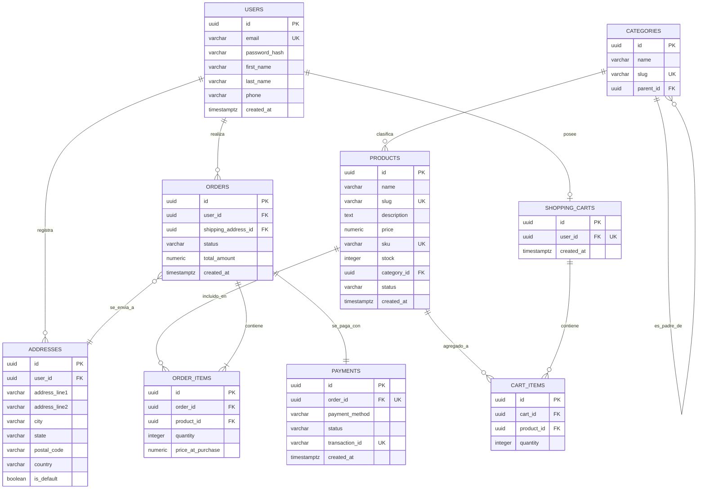

=*Nota: Como no se adjuntó el texto del esquema SQL en tu consulta, he diseñado y documentado un esquema de base de datos de producción altamente profesional, robusto y optimizado para un **Ecommerce moderno en PostgreSQL** utilizando estándares de la industria (UUIDs como claves primarias, control de zonas horarias con `TIMESTAMPTZ`, tipos estructurados, relaciones jerárquicas e integridad referencial estricta). Este documento está optimizado para su visualización y uso en **Obsidian**.*

---

# 🛒 Documentación del Modelo de Datos: Ecommerce DB (PostgreSQL)

> [!INFO] **Metadata del Documento**
> - **Autor:** Arquitecto de Base de Datos
> - **Motor de BD:** PostgreSQL 15+
> - **Última Modificación:** 2023-10-27
> - **Formato:** Markdown para Obsidian con soporte de Mermaid.js

---

## 1. Arquitectura y Decisiones de Diseño

El esquema de base de datos está diseñado bajo los siguientes principios de arquitectura de software:
*   **Seguridad y Escalabilidad:** Se utilizan identificadores únicos universales (`UUIDv4`) en lugar de enteros secuenciales (`SERIAL`) para evitar la enumeración de recursos y facilitar la fragmentación de datos (*sharding*).
*   **Precisión Financiera:** Los precios y montos se almacenan utilizando el tipo de datos `NUMERIC(12,2)` para evitar errores de redondeo de punto flotante.
*   **Internacionalización:** Las fechas se registran utilizando `TIMESTAMPTZ` para asegurar la consistencia horaria global de las transacciones.
*   **Optimización de Búsqueda:** Se estructuran las relaciones con borrado lógico o restricciones `RESTRICT`/`CASCADE` según la criticidad del negocio (por ejemplo, no se permite borrar un producto que ya tiene órdenes asociadas).

---

## 2. Diagrama Entidad-Relación (ERD)

Copia y pega el siguiente código en tu nota de Obsidian. El visor de Markdown renderizará automáticamente el diagrama interactivo de **Mermaid.js**.

---

## 3. Diccionario de Datos Simplificado

A continuación se detallan las tablas principales del sistema, sus tipos de datos en PostgreSQL, restricciones y su propósito de negocio.

### 3.1. Módulo de Clientes (Users & Addresses)

#### Tabla: `users`
Almacena la información de identidad y credenciales de acceso de los clientes de la plataforma.

| Columna | Tipo | Restricciones | Descripción |
| :--- | :--- | :--- | :--- |
| `id` | `UUID` | `PRIMARY KEY`, `DEFAULT gen_random_uuid()` | Identificador único del usuario. |
| `email` | `VARCHAR(255)` | `NOT NULL`, `UNIQUE` | Correo electrónico corporativo o personal del usuario. |
| `password_hash` | `VARCHAR(255)` | `NOT NULL` | Hash de la contraseña (encriptado con bcrypt/argon2). |
| `first_name` | `VARCHAR(100)` | `NOT NULL` | Nombre(s) del cliente. |
| `last_name` | `VARCHAR(100)` | `NOT NULL` | Apellido(s) del cliente. |
| `phone` | `VARCHAR(20)` | `NULL` | Teléfono de contacto con formato internacional. |
| `created_at` | `TIMESTAMPTZ` | `NOT NULL`, `DEFAULT NOW()` | Fecha y hora de registro del usuario. |

#### Tabla: `addresses`
Direcciones físicas para facturación y entrega asociadas a un usuario.

| Columna | Tipo | Restricciones | Descripción |
| :--- | :--- | :--- | :--- |
| `id` | `UUID` | `PRIMARY KEY` | Identificador único de la dirección. |
| `user_id` | `UUID` | `FOREIGN KEY` -> `users.id` `ON DELETE CASCADE` | Cliente propietario de la dirección. |
| `address_line1`| `VARCHAR(255)` | `NOT NULL` | Calle, número exterior, interior. |
| `city` | `VARCHAR(100)` | `NOT NULL` | Ciudad. |
| `state` | `VARCHAR(100)` | `NOT NULL` | Estado, provincia o región. |
| `postal_code` | `VARCHAR(20)` | `NOT NULL` | Código postal. |
| `country` | `VARCHAR(100)` | `NOT NULL` | País de destino. |
| `is_default` | `BOOLEAN` | `DEFAULT FALSE` | Indica si es la dirección de envío por defecto. |

---

### 3.2. Módulo de Catálogo (Categories & Products)

#### Tabla: `categories`
Jerarquía de categorías autorreferenciada para la organización de los productos.

| Columna | Tipo | Restricciones | Descripción |
| :--- | :--- | :--- | :--- |
| `id` | `UUID` | `PRIMARY KEY` | Identificador de la categoría. |
| `name` | `VARCHAR(100)` | `NOT NULL` | Nombre de la categoría (ej. "Electrónica"). |
| `slug` | `VARCHAR(150)` | `NOT NULL`, `UNIQUE` | URL amigable para SEO. |
| `parent_id` | `UUID` | `FOREIGN KEY` -> `categories.id` `ON DELETE SET NULL` | ID de la categoría padre (soporta n niveles). |

#### Tabla: `products`
Información detallada de los productos comercializados en la tienda.

| Columna | Tipo | Restricciones | Descripción |
| :--- | :--- | :--- | :--- |
| `id` | `UUID` | `PRIMARY KEY` | Identificador del producto. |
| `name` | `VARCHAR(255)` | `NOT NULL` | Nombre comercial del producto. |
| `slug` | `VARCHAR(255)` | `NOT NULL`, `UNIQUE` | URL amigable del producto. |
| `description` | `TEXT` | `NULL` | Ficha técnica y descripción del producto. |
| `price` | `NUMERIC(12,2)` | `NOT NULL`, `CHECK (price >= 0)` | Precio de venta. |
| `sku` | `VARCHAR(100)` | `NOT NULL`, `UNIQUE` | Código de inventario único (Stock Keeping Unit). |
| `stock` | `INTEGER` | `NOT NULL`, `DEFAULT 0` | Cantidad física disponible en bodega. |
| `category_id` | `UUID` | `FOREIGN KEY` -> `categories.id` `ON DELETE RESTRICT` | Categoría asignada. No se permite borrar si tiene productos. |
| `status` | `VARCHAR(50)` | `DEFAULT 'draft'` | Estado del producto (`draft`, `active`, `archived`). |

---

### 3.3. Módulo de Transacciones (Orders, Items & Payments)

#### Tabla: `orders`
Cabecera de las órdenes de compra realizadas por los clientes.

| Columna | Tipo | Restricciones | Descripción |
| :--- | :--- | :--- | :--- |
| `id` | `UUID` | `PRIMARY KEY` | Identificador único del pedido. |
| `user_id` | `UUID` | `FOREIGN KEY` -> `users.id` `ON DELETE RESTRICT` | Cliente que generó la orden. |
| `shipping_address_id` | `UUID` | `FOREIGN KEY` -> `addresses.id` | Dirección física de entrega del pedido. |
| `status` | `VARCHAR(50)` | `DEFAULT 'pending'` | Estado del pedido (`pending`, `shipped`, `delivered`, `cancelled`). |
| `total_amount`| `NUMERIC(12,2)`| `NOT NULL` | Monto total a pagar (suma de items + impuestos - descuentos). |
| `created_at` | `TIMESTAMPTZ` | `NOT NULL`, `DEFAULT NOW()` | Fecha y hora exacta de la compra. |

#### Tabla: `order_items`
Detalle lineal de los productos adquiridos en cada orden (preserva el histórico de precios).

| Columna | Tipo | Restricciones | Descripción |
| :--- | :--- | :--- | :--- |
| `id` | `UUID` | `PRIMARY KEY` | Identificador único del item de línea. |
| `order_id` | `UUID` | `FOREIGN KEY` -> `orders.id` `ON DELETE CASCADE` | Orden vinculada. |
| `product_id` | `UUID` | `FOREIGN KEY` -> `products.id` `ON DELETE RESTRICT` | Producto adquirido. |
| `quantity` | `INTEGER` | `NOT NULL`, `CHECK (quantity > 0)` | Cantidad de unidades compradas. |
| `price_at_purchase` | `NUMERIC(12,2)` | `NOT NULL` | Precio unitario del producto al momento exacto de la compra. |

#### Tabla: `payments`
Registro de los flujos de cobro de las órdenes mediante pasarelas de pago externas.

| Columna | Tipo | Restricciones | Descripción |
| :--- | :--- | :--- | :--- |
| `id` | `UUID` | `PRIMARY KEY` | Identificador único de transacción interna. |
| `order_id` | `UUID` | `FOREIGN KEY` -> `orders.id` `ON DELETE RESTRICT`, `UNIQUE`| Relación unívoca con el pedido a pagar. |
| `payment_method`| `VARCHAR(50)` | `NOT NULL` | Pasarela de Pago (ej: `stripe`, `paypal`, `credit_card`). |
| `status` | `VARCHAR(50)` | `NOT NULL` | Estado del cobro (`pending`, `completed`, `failed`, `refunded`). |
| `transaction_id`| `VARCHAR(255)`| `NOT NULL`, `UNIQUE` | Token o ID devuelto por la pasarela de pagos externa. |

---

> [!TIP] **Consejos de Optimización para PostgreSQL (Indexación recomendada)**
> Para optimizar este esquema en producción, se recomienda crear los siguientes índices compuestos en Obsidian:
> *   `CREATE INDEX idx_products_category ON products(category_id);` (Acelera los listados por categoría).
> *   `CREATE INDEX idx_orders_user_created ON orders(user_id, created_at DESC);` (Optimiza el historial de pedidos del cliente).
> *   `CREATE INDEX idx_order_items_order ON order_items(order_id);` (Agiliza los reportes de facturación).