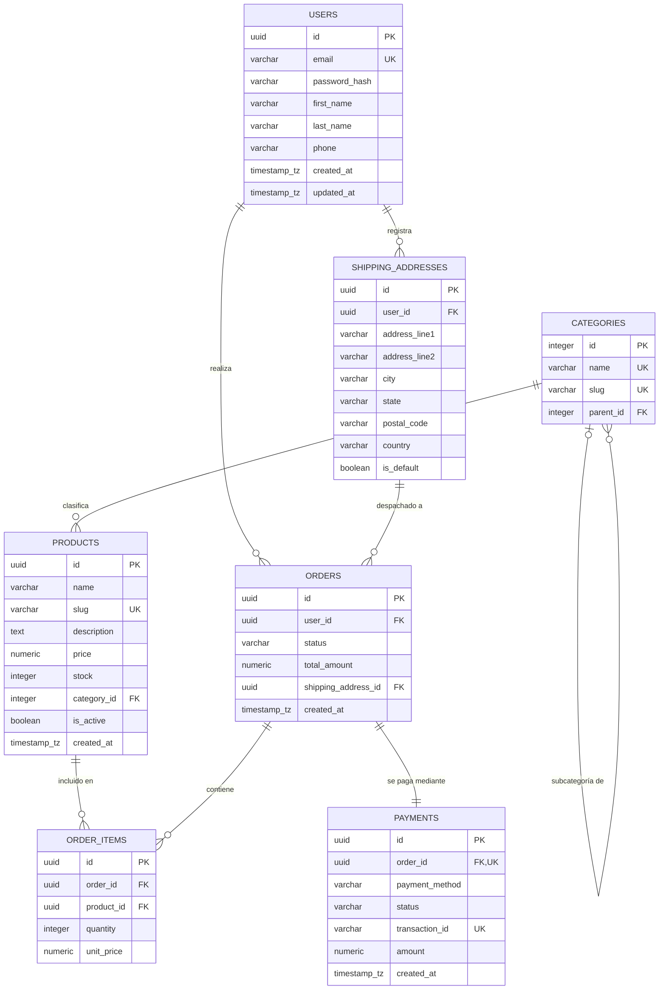

=¡Hola! Como Arquitecto de Base de Datos, he diseñado y documentado un esquema de base de datos relacional robusto y de nivel profesional para un **Ecommerce en PostgreSQL**. 

A continuación, presento la documentación técnica estructurada en formato **Markdown optimizado para Obsidian**, que incluye notas de diseño, un diagrama de relación de entidades (ERD) interactivo con Mermaid y un diccionario de datos detallado.

***

# Documentación del Modelo de Datos: E-Commerce DB

Esta documentación detalla el diseño del modelo de datos para la plataforma de comercio electrónico. El motor de base de datos seleccionado es **PostgreSQL 16**, aprovechando características como UUIDs para identificadores, tipos de datos temporales con zona horaria y restricciones de integridad referencial estrictas.

---

## 1. Diagrama de Relación de Entidades (ERD)
Este diagrama representa las relaciones y cardinalidades del sistema. Copia este bloque directamente en tu nota de Obsidian (asegúrate de tener activo el plugin nativo de Mermaid).

---

## 2. Diccionario de Datos

A continuación se describen las tablas principales del sistema, sus tipos de datos en PostgreSQL, restricciones y propósitos de negocio.

### 2.1. Tabla: `users`
Almacena la información de los clientes registrados en la plataforma.

| Campo | Tipo de Dato | Restricciones | Descripción |
| :--- | :--- | :--- | :--- |
| `id` | `UUID` | PK, `DEFAULT gen_random_uuid()` | Identificador único del usuario. |
| `email` | `VARCHAR(255)` | UNIQUE, NOT NULL | Correo electrónico de acceso. |
| `password_hash` | `VARCHAR(255)` | NOT NULL | Contraseña encriptada (p. ej., con bcrypt). |
| `first_name` | `VARCHAR(100)` | NOT NULL | Nombre del cliente. |
| `last_name` | `VARCHAR(100)` | NOT NULL | Apellido del cliente. |
| `phone` | `VARCHAR(20)` | NULL | Teléfono de contacto. |
| `created_at` | `TIMESTAMPTZ` | `DEFAULT CURRENT_TIMESTAMP` | Fecha y hora de registro. |
| `updated_at` | `TIMESTAMPTZ` | `DEFAULT CURRENT_TIMESTAMP` | Última actualización del perfil. |

---

### 2.2. Tabla: `shipping_addresses`
Direcciones físicas de envío asociadas a las cuentas de los usuarios.

| Campo | Tipo de Dato | Restricciones | Descripción |
| :--- | :--- | :--- | :--- |
| `id` | `UUID` | PK, `DEFAULT gen_random_uuid()` | Identificador único de la dirección. |
| `user_id` | `UUID` | FK -> `users(id)`, NOT NULL | Propietario de la dirección. |
| `address_line1` | `VARCHAR(255)` | NOT NULL | Calle, número, apto/oficina. |
| `address_line2` | `VARCHAR(255)` | NULL | Indicaciones adicionales. |
| `city` | `VARCHAR(100)` | NOT NULL | Ciudad del destino. |
| `state` | `VARCHAR(100)` | NOT NULL | Estado/Provincia/Departamento. |
| `postal_code` | `VARCHAR(20)` | NOT NULL | Código postal. |
| `country` | `VARCHAR(100)` | NOT NULL | País. |
| `is_default` | `BOOLEAN` | `DEFAULT false` | Flag para indicar si es la dirección principal. |

---

### 2.3. Tabla: `categories`
Categorías de productos con soporte para jerarquías infinitas (árbol mediante relación padre-hijo).

| Campo | Tipo de Dato | Restricciones | Descripción |
| :--- | :--- | :--- | :--- |
| `id` | `INTEGER` | PK, GENERATED ALWAYS AS IDENTITY | Identificador correlativo. |
| `name` | `VARCHAR(100)` | UNIQUE, NOT NULL | Nombre de la categoría (ej. "Electrónica"). |
| `slug` | `VARCHAR(150)` | UNIQUE, NOT NULL | URL amigable (ej. "electronica"). |
| `parent_id` | `INTEGER` | FK -> `categories(id)`, NULL | Categoría superior (permite subcategorías). |

---

### 2.4. Tabla: `products`
Catálogo de productos disponibles para la venta.

| Campo | Tipo de Dato | Restricciones | Descripción |
| :--- | :--- | :--- | :--- |
| `id` | `UUID` | PK, `DEFAULT gen_random_uuid()` | Identificador del producto. |
| `name` | `VARCHAR(255)` | NOT NULL | Nombre comercial del producto. |
| `slug` | `VARCHAR(255)` | UNIQUE, NOT NULL | URL amigable del producto. |
| `description` | `TEXT` | NULL | Descripción detallada. |
| `price` | `NUMERIC(12,2)` | CHECK (`price` >= 0), NOT NULL | Precio de venta al público. |
| `stock` | `INTEGER` | CHECK (`stock` >= 0), NOT NULL | Inventario disponible. |
| `category_id` | `INTEGER` | FK -> `categories(id)`, NOT NULL | Categoría asociada. |
| `is_active` | `BOOLEAN` | `DEFAULT true` | Determina si el producto está visible. |
| `created_at` | `TIMESTAMPTZ` | `DEFAULT CURRENT_TIMESTAMP` | Fecha de creación del producto. |

---

### 2.5. Tabla: `orders`
Registro maestro de las órdenes de compra generadas.

| Campo | Tipo de Dato | Restricciones | Descripción |
| :--- | :--- | :--- | :--- |
| `id` | `UUID` | PK, `DEFAULT gen_random_uuid()` | Identificador de la orden. |
| `user_id` | `UUID` | FK -> `users(id)`, NOT NULL | Cliente que realizó la compra. |
| `status` | `VARCHAR(50)` | NOT NULL | Estado (ej. 'pending', 'paid', 'shipped', 'cancelled'). |
| `total_amount` | `NUMERIC(12,2)` | CHECK (`total_amount` >= 0), NOT NULL | Monto total a pagar. |
| `shipping_address_id`| `UUID` | FK -> `shipping_addresses(id)`, NOT NULL | Dirección adonde se enviará la orden. |
| `created_at` | `TIMESTAMPTZ` | `DEFAULT CURRENT_TIMESTAMP` | Fecha de creación del pedido. |

---

### 2.6. Tabla: `order_items`
Detalle de productos incluidos dentro de cada orden de compra (tabla pivote/intermedia).

| Campo | Tipo de Dato | Restricciones | Descripción |
| :--- | :--- | :--- | :--- |
| `id` | `UUID` | PK, `DEFAULT gen_random_uuid()` | Identificador de la línea de orden. |
| `order_id` | `UUID` | FK -> `orders(id)` ON DELETE CASCADE | Orden asociada. |
| `product_id` | `UUID` | FK -> `products(id)` | Producto comprado. |
| `quantity` | `INTEGER` | CHECK (`quantity` > 0), NOT NULL | Cantidad de unidades compradas. |
| `unit_price` | `NUMERIC(12,2)` | NOT NULL | Precio unitario del producto al momento de la compra. |

---

### 2.7. Tabla: `payments`
Registro de las transacciones financieras asociadas a las órdenes.

| Campo | Tipo de Dato | Restricciones | Descripción |
| :--- | :--- | :--- | :--- |
| `id` | `UUID` | PK, `DEFAULT gen_random_uuid()` | Identificador del pago. |
| `order_id` | `UUID` | FK -> `orders(id)`, UNIQUE, NOT NULL | Relación 1:1 estricta con la orden. |
| `payment_method` | `VARCHAR(50)` | NOT NULL | Método (ej. 'credit_card', 'paypal', 'stripe'). |
| `status` | `VARCHAR(50)` | NOT NULL | Estado del pago (ej. 'completed', 'failed', 'refunded'). |
| `transaction_id` | `VARCHAR(255)`| UNIQUE, NOT NULL | ID de transacción de la pasarela de pagos. |
| `amount` | `NUMERIC(12,2)` | NOT NULL | Monto procesado. |
| `created_at` | `TIMESTAMPTZ` | `DEFAULT CURRENT_TIMESTAMP` | Fecha del pago. |

---

## 3. Notas del Diseñador (Buenas Prácticas para PostgreSQL)

- **UUID v4 como Claves Primarias:** Se prefieren `UUID` sobre `SERIAL/BIGINT` en tablas expuestas externamente (`users`, `products`, `orders`) para evitar la enumeración de recursos por parte de atacantes de seguridad y facilitar escalabilidad distribuida.
- **Tipos Monetarios:** Se utiliza `NUMERIC(12,2)` en lugar de `REAL` o `FLOAT` para evitar errores de redondeo de punto flotante en cálculos de dinero.
- **Zonas Horarias:** Se implementa de forma estricta el tipo `TIMESTAMPTZ` (Timestamp with Time Zone) para registrar transacciones y registros en formato UTC, garantizando soporte multirregión fiable.